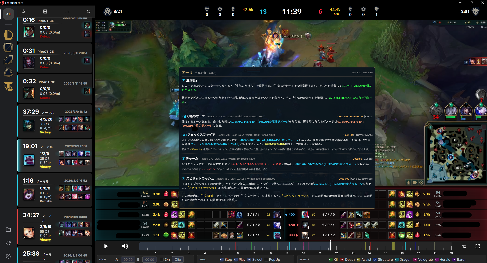

# LeagueRecord Custom

[English](readme.md) | [日本語](README_ja.md)

**注意**: 本プロジェクトは [LeagueRecord](https://github.com/FFFFFFFXXXXXXX/league_record) をベースにしたカスタムバージョンです。
[v2.1.1](https://github.com/FFFFFFFXXXXXXX/league_record/releases/tag/v2.1.1) を基にしており、すべての機能追加や変更はこのバージョン上に構築されています。

## 追加・変更された機能

このバージョンでは以下の変更が実装されています。

- **UI機能**: ユーザーインターフェースやデザインの変更。
- **手動録画**: ホットキーを使用した手動での録画開始・停止。
- **ステータス表示**: 現在の録画ステータスに応じてタスクバーのアイコンが変化。
- **ゲームモードフィルター**: 特定のゲームモード（ランク、ARAM、アリーナなど）のみを録画する設定。
- **再生コントロール**: ゲーム状況に基づく自動再生、停止、録画選択。
- **ビデオツール**: A-Bループ再生およびクリップ動画の作成（同梱FFmpegでそのまま利用可能）。
- **設定周り**: ホットキーや一般設定項目の拡張。
- **ツールチップ**: ツールチップのデータはローカルのWADファイルから取得しているため、最新パッチにも対応。

## ダウンロード

**[LeagueRecordをダウンロード（インストーラー版）](https://github.com/arasan95/league_record_custom/releases/latest/download/LeagueRecord_x64-setup.exe)**

すべてのバージョンを見る: [GitHub Releases](https://github.com/arasan95/league_record_custom/releases)

インストーラー版にはFFmpegが同梱されるため、通常は追加インストールなしでクリップ機能を利用できます。

## Tooltip運用ドキュメント（引き継ぎ）

Tooltip修正の運用手順、参照ファイル、生成方法、検出方法は以下を参照してください。  
`TOOLTIP_HANDOVER_JA.md`

## FFmpegについて

通常利用では、インストーラー版に同梱されたFFmpegが自動で使われます。  
開発者向けに手動で差し替える場合のみ、`src-tauri/resources/tools/ffmpeg/` 配下の更新を行ってください。

## 使い方

### A-B ループ ＆ クリップ機能

確認または書き出したい区間（セグメント）を定義します。

- **ポイント設定**: デフォルトのホットキーを使用して、開始ポイント（A）と終了ポイント（B）を設定します。
- **ループ切替**: `L` キーを押すと、AとBの間のリピート再生を開始（またはキャンセル）します。
- **クリップ作成**: クリップボタンをクリックすると、A〜B間の動画を新しいファイルとして切り出してエクスポートします。

### オートモード設定

ゲームの状況に応じて自動でアプリが動作するよう設定できます。

- **Stop**: 新しいゲームセッションが開始された際に、動画の再生を自動的に停止します。
- **Play**: 録画が選択されると、自動的に再生を開始します。
- **Select**: ゲーム終了直後に、最新の録画を自動的に選択します。
- **PopUp**: 録画完了時に、プレイヤーウィンドウを自動で前面に表示します。

### マウス＆キーボードコントロール

- **戻る / 進む ボタン**: 5秒単位の巻き戻し・早送り。
- **修飾キー + スクロール**: 微細なシークやコマ送り（設定で変更可能）。
- **スクロール**: 再生速度を0.1倍単位で調整。
- **ミドルクリック（ホイールクリック）**: 再生速度を標準の1.0倍にリセット。

### スコアボードトラッカー

- スコアボードのサモナー名をクリックすると、設定したトラッカーサイト（例：OP.GG）でそのプロフィールを開きます。

---

### 実装を見送った機能

以下の機能は、現在のAPIの制限により実装できませんでした。

- **ロールクエスト進捗**: サポート/ジャングルアイテムのクエストのリアルタイム追跡不可。
- **リアルタイムCS＆ゴールド**: CSとゴールドの値は60秒ごとにしか更新されません。
- **サモナースペルCD**: スコアボード上でのライブクールダウン追跡は未サポート。
- **賞金（バウンティ）表示**: チャンピオンの現在の賞金をライブで取得することはできません。
- **バロンパワープレイ**: バロンバフ中の正確な獲得ゴールドの計算は不可能です。
- **正確なロール検出**: プラクティスツールやAI戦などの非標準モードでは、ロール割り当てが不正確になる場合があります。

> UIに変更が想定通り反映されない場合は、**F5キー**を押して表示をリフレッシュしてください。

問題、ご質問、ご提案がある場合は、お気軽にIssueを開くか、下記までご連絡ください。
<arasan1115525@gmail.com>
[Googleフォーム](https://docs.google.com/forms/d/e/1FAIpQLScM3I0di-DeqQACBhGfrewibuos2xl-pTNv4XoYhK3R0p3ziA/viewform)

---

（以下、ベースプロジェクトのドキュメントの翻訳等は省略・または上記の機能を参考にしてください）
